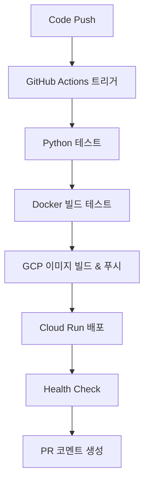

# 🤖 DingQ 자동화 스크립트 가이드

DingQ 프로젝트의 모든 자동화 스크립트와 사용법을 정리한 문서입니다.

## 📋 목차

1. [로컬 개발 환경](#-로컬-개발-환경)
2. [GCP 배포](#-gcp-배포)
3. [CI/CD 파이프라인](#-cicd-파이프라인)
4. [프로젝트 초기 설정](#-프로젝트-초기-설정)

---

## 🏠 로컬 개발 환경

### `start-local.ps1` (Windows PowerShell)

로컬 개발 환경을 쉽게 관리할 수 있는 스크립트입니다.

```powershell
# 기본 실행 (서비스 시작)
.\start-local.ps1

# 이미지 다시 빌드하면서 시작
.\start-local.ps1 -Build

# 기본 API 테스트 포함
.\start-local.ps1 -Test

# 로그 확인
.\start-local.ps1 -Logs

# 서비스 중지
.\start-local.ps1 -Stop

# 전체 정리 (컨테이너, 볼륨 삭제)
.\start-local.ps1 -Clean
```

### 기본 Docker Compose 명령어

```bash
# 서비스 시작
docker-compose up -d

# 로그 확인
docker-compose logs -f

# 서비스 중지
docker-compose down

# 전체 정리
docker-compose down --volumes --remove-orphans
```

---

## ☁️ GCP 배포

### 1. Windows PowerShell 배포 (`DingQ_BE/deploy.ps1`)

```powershell
# 환경 변수 설정
$env:GCP_PROJECT_ID = "your-project-id"

# 배포 실행
cd DingQ_BE
.\deploy.ps1

# 또는 매개변수로 직접 지정
.\deploy.ps1 -ProjectId "your-project-id" -Region "asia-northeast3"
```

### 2. Linux/Mac 배포 (`DingQ_BE/deploy.sh`)

```bash
# 환경 변수 설정
export GCP_PROJECT_ID="your-project-id"
export GCP_REGION="us-central1"

# 배포 실행
cd DingQ_BE
./deploy.sh
```

### 3. 수동 배포 (단계별)

```bash
# 1. 환경 변수 설정
export PROJECT_ID="your-project-id"
export REGION="us-central1"
export SERVICE_NAME="dingq-backend"

# 2. 프로젝트 설정
gcloud config set project $PROJECT_ID

# 3. 이미지 빌드 및 푸시
cd DingQ_BE
docker build -t gcr.io/$PROJECT_ID/$SERVICE_NAME .
docker push gcr.io/$PROJECT_ID/$SERVICE_NAME

# 4. Cloud Run 배포
gcloud run deploy $SERVICE_NAME \
  --image gcr.io/$PROJECT_ID/$SERVICE_NAME \
  --platform managed \
  --region $REGION \
  --allow-unauthenticated \
  --memory 4Gi \
  --cpu 2 \
  --timeout 300 \
  --port 8000
```

---

## 🔄 CI/CD 파이프라인

### GitHub Actions 설정

1. **Repository Secrets 설정**
   - `GCP_PROJECT_ID`: GCP 프로젝트 ID
   - `GCP_SA_KEY`: 서비스 계정 JSON 키

2. **자동 배포 트리거**
   - `main` 브랜치에 push할 때
   - `gcp-test` 브랜치에 push할 때
   - Pull Request 생성 시 (테스트만)

3. **워크플로우 구성**
   ```yaml
   # .github/workflows/deploy-gcp.yml
   # 테스트 → 빌드 → 배포 → 검증
   ```

### 배포 흐름



---

## 🔧 프로젝트 초기 설정

### `setup-gcp.ps1` (Windows PowerShell)

새 GCP 프로젝트를 위한 초기 설정 스크립트입니다.

```powershell
# 필수: 프로젝트 ID 지정
.\setup-gcp.ps1 -ProjectId "your-project-id"

# 선택적: 리전 및 서비스 계정 이름 지정
.\setup-gcp.ps1 -ProjectId "your-project-id" -Region "asia-northeast1" -ServiceAccount "my-deploy-sa"
```

### 설정 작업 내용

1. **API 활성화**
   - Cloud Run API
   - Cloud Build API
   - Container Registry API
   - Artifact Registry API
   - SQL Admin API

2. **서비스 계정 생성**
   - 배포용 서비스 계정 생성
   - 필요한 IAM 역할 부여
   - 서비스 계정 키 생성

3. **환경 설정**
   - `.env` 파일 생성
   - 환경 변수 설정

---

## 🚀 빠른 시작 가이드

### 1. 로컬 개발 시작

```powershell
# 저장소 클론
git clone https://github.com/Borrowed-Cat/DingQ.git
cd DingQ

# 브랜치 전환
git checkout gcp-test

# 로컬 환경 시작
.\start-local.ps1 -Build -Test
```

### 2. GCP 배포 시작

```powershell
# GCP 프로젝트 설정
.\setup-gcp.ps1 -ProjectId "your-project-id"

# 배포 실행
cd DingQ_BE
.\deploy.ps1
```

### 3. GitHub Actions 설정

```bash
# GitHub Repository에 Secrets 추가
# - GCP_PROJECT_ID: your-project-id
# - GCP_SA_KEY: (gcp-service-account.json 내용)

# 코드 푸시하면 자동 배포
git add .
git commit -m "feat: add new feature"
git push origin gcp-test
```

---

## 🔍 트러블슈팅

### 일반적인 문제들

1. **gcloud CLI 설치 문제**
   ```powershell
   # Windows에서 gcloud CLI 설치
   # https://cloud.google.com/sdk/docs/install-sdk
   ```

2. **권한 문제**
   ```bash
   # 인증 확인
   gcloud auth list
   gcloud auth login
   
   # 프로젝트 확인
   gcloud config list
   ```

3. **Docker 빌드 문제**
   ```bash
   # Docker 상태 확인
   docker version
   docker-compose version
   
   # 이미지 정리
   docker system prune -f
   ```

4. **포트 충돌**
   ```powershell
   # 포트 사용 확인
   netstat -ano | findstr :8000
   
   # 프로세스 종료
   taskkill /PID <PID> /F
   ```

---

## 📊 모니터링 및 로그

### 로컬 환경
- **서비스 상태**: `docker-compose ps`
- **로그 확인**: `docker-compose logs -f`
- **헬스 체크**: `http://localhost:8000/health`

### GCP 환경
- **서비스 상태**: `gcloud run services list`
- **로그 확인**: `gcloud logs read --service=dingq-backend`
- **메트릭**: GCP Console → Cloud Run → 서비스 선택

---

## 🛡️ 보안 고려사항

1. **서비스 계정 키 보안**
   - `gcp-service-account.json` 파일을 절대 커밋하지 마세요
   - GitHub Secrets에 안전하게 저장하세요

2. **환경 변수 관리**
   - 민감한 정보는 `.env` 파일에 저장
   - `.env` 파일을 `.gitignore`에 추가

3. **네트워크 보안**
   - 필요시 `--no-allow-unauthenticated` 옵션 사용
   - VPC 연결 설정 고려

---

## 💡 추가 리소스

- [GCP Cloud Run 문서](https://cloud.google.com/run/docs)
- [Docker Compose 문서](https://docs.docker.com/compose/)
- [GitHub Actions 문서](https://docs.github.com/en/actions)
- [FastAPI 배포 가이드](https://fastapi.tiangolo.com/deployment/)

---

**📞 문의사항이 있으시면 GitHub Issues를 활용해주세요!** 

# 특정 사용자에게 권한 부여
gcloud run services add-iam-policy-binding dingq-backend --region=asia-northeast3 --member="user:someone@gmail.com" --role="roles/run.invoker"

# 특정 그룹에게 권한 부여
gcloud run services add-iam-policy-binding dingq-backend --region=asia-northeast3 --member="group:developers@yourcompany.com" --role="roles/run.invoker"

# 서비스 계정에게 권한 부여
gcloud run services add-iam-policy-binding dingq-backend --region=asia-northeast3 --member="serviceAccount:my-service@project.iam.gserviceaccount.com" --role="roles/run.invoker"

# gcloud로 인증 토큰 받아서 접근
curl -H "Authorization: Bearer $(gcloud auth print-identity-token)" https://your-service-url/health